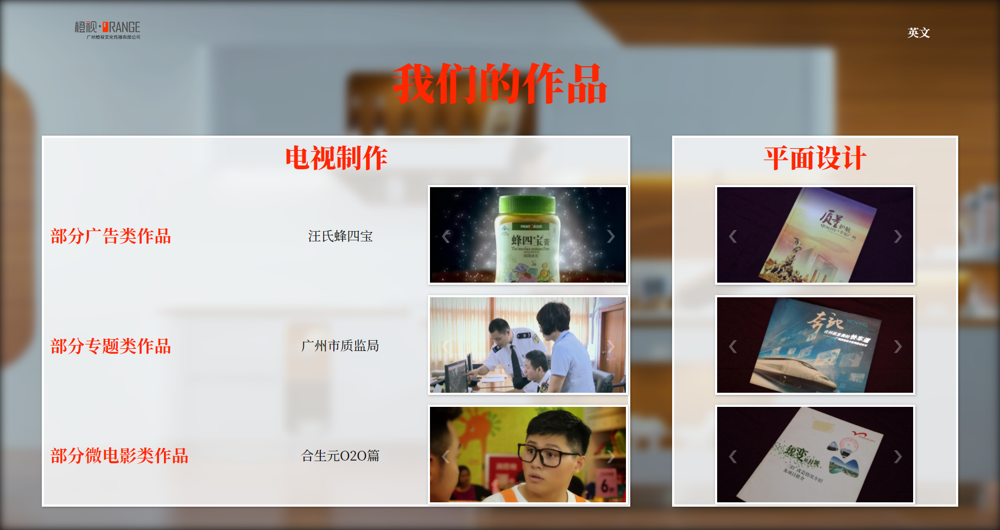

# Orange Visual Culture
A website created for Orange Visual Culture Co. Ltd., designed with specifications requested by client.

**This project was abandoned so the English side of the site still uses placeholder text.**

## [Demo](https://orangevisual.herokuapp.com/index_en.html)

## Features

## Responsive
Site will scale well with most resolutions and screen sizes.

### Desktop Size

### Mobile Size

## Dropdown
The Services button, if hovered, will create a dropdown of more specific options.

## Image Sliders
Both automatic and manual image sliders were implemented in this project.
### Automatic Slider

### Manual Slider

